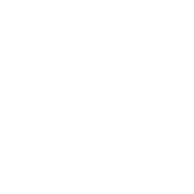
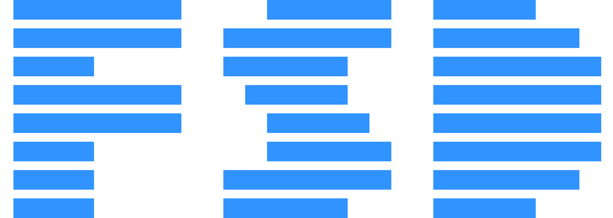

#  Hi, I'm Sabyrzhan

I'm a **Frontend Developer** passionate about creating clean, responsive, and user-friendly interfaces.

Currently honing my skills in **React** and **TypeScript**, working on real projects and writing structured, maintainable code.

I’m eager to join a product team where I can contribute, learn from experienced developers, and grow as an engineer.

##  Tech Stack

<table>
  <thead>
    <tr>
      <th>Core</th>
      <th>Languages</th>
      <th>Frameworks</th>
      <th>Architecture</th>
      <th>Tools</th>
    </tr>
  </thead>
  <tbody>
    <tr>
      <td>
        &nbsp;&nbsp;
      </td>
    </tr>
  </tbody>
</table>

### Core: 
&nbsp;&nbsp;

### Languages:

### Frameworks:

### Architecture:
&nbsp;

### Tools:

